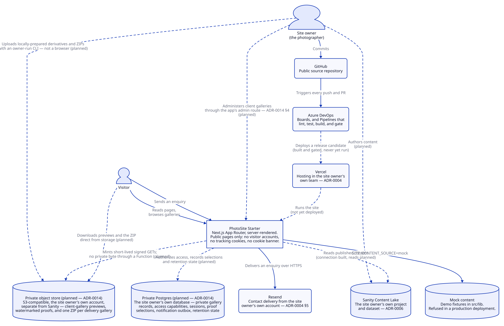
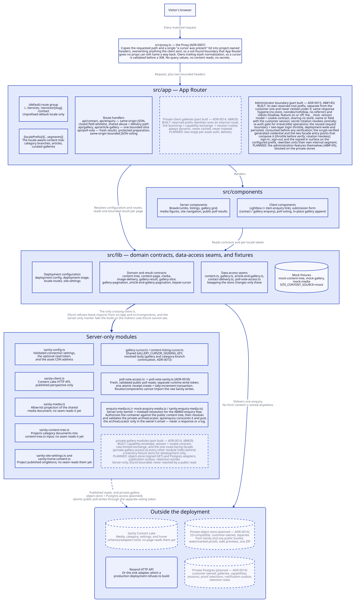
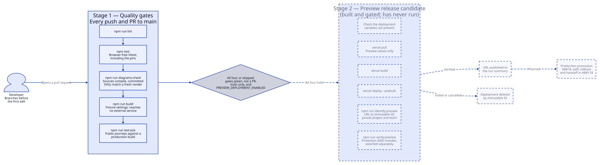

# Architecture diagrams

Three pictures of this project at the level that changes slowly: the systems around
it, the boundaries inside it, and the path from a commit to a deployment.

Each diagram is a `.d2` source file and a `.svg` rendered from it. **The `.d2` file is
authoritative. The `.svg` is a build artifact and is never edited by hand** — the next
`npm run diagrams` would overwrite the edit, and the CI gate would fail before that.

Both halves are committed on purpose. The source is what a pull request can actually
review, because a one-line change to a relationship shows up as a one-line diff. The
rendition is what makes the diagram readable here, on GitHub, and from a clone without
installing a toolchain first.

## The diagrams

### System context

**Purpose:** every system outside this repository that a deployed clone depends on, and
who owns each one.



A visitor reads pages and sends contact enquiries to the site, and does nothing else —
there are no visitor accounts, no tracking cookies, and no cookie banner to need.

The three external systems on the bottom row are the ownership boundary this project is
built around, and it is the boundary that makes a clone a clone rather than a tenant.
The **Sanity Content Lake**, the **Resend** account that delivers contact enquiries, and
the **Vercel** team that hosts the site all belong to the site owner. There is no shared
credential and no cross-customer store anywhere in the picture, which is why handing the
site to its owner is a change of settings rather than a change of code
([ADR-0004](../adr/0004-reference-production-host-and-ownership-boundary.md),
[ADR-0006](../adr/0006-sanity-data-access-boundary.md)).

**What the dashed edges mean here.** The site reads its content from **mock fixtures**
today, not from Sanity: the connection, its published-perspective query client, and the
enforced data-access boundary are built, but the schemas and adapters that would put
authored content behind them are not. The pipeline's deploy stage is written and gated
but has never run, because the Vercel project is still being provisioned. Both are
drawn as intentions rather than as facts.

### Application and data boundaries

**Purpose:** the layers a request crosses, and the one crossing the build refuses to
compile.



A request enters through **`src/proxy.ts`**, which copies the requested path and a
single "a cursor was present" bit into project-owned headers, overwriting whatever the
client sent. That exists because App Router renders a not-found boundary with no props
and renders it before the page, so nothing in the tree can tell it which address failed
([ADR-0007](../adr/0007-proxy-request-path-boundary.md)). The Proxy runs on every
matched request, so it deliberately reads no content, holds no secret, and never copies
the cursor's *value* — only whether one was there.

From there the request reaches **`src/app`**, which renders **`src/components`**, and
both read contracts and bounded results from **`src/lib`**. Nothing above `src/lib`
knows where content comes from: routes import a data-access seam
(`content.ts`, `gallery.ts`, `contact-delivery.ts`) and receive the project's own types,
never a provider's. That is what makes swapping the mock fixtures for a CMS adapter a
change to three files instead of a change to every page.

**The thick edge is the point of the diagram.** `src/lib` is the only layer permitted to
reach the server-only modules — the Sanity connection settings and read token, the
Content Lake HTTP client, and the gallery cursor signing key. This is enforced twice, by
tooling rather than by convention:

- ESLint's `no-restricted-imports` fails `npm run lint` when anything in `src/app` or
  `src/components` imports `@/lib/sanity-client`, `@/lib/sanity-config`, or
  `@/lib/gallery-cursor`.
- The `server-only` marker fails `npm run build` on the indirect case ESLint cannot see —
  a Client Component that reaches a server module through an adapter.

Without both, provider knowledge and eventually a credential would drift into the render
tree, and "replacing the CMS is a change to `src/lib`" would quietly stop being true.

### Build and deployment flow

**Purpose:** the gate order, and what happens to a release candidate that fails its
checks.



Every push and pull request to `main` runs the full quality gate: lint, the browser-free
Vitest suite, this diagram check, a production build on fixture settings, and the
Playwright public-journey suite against a real production build. None of those steps
reaches an external service, by design.

Two things in this flow are easy to lose when reading the YAML, and both are
[ADR-0004 §3](../adr/0004-reference-production-host-and-ownership-boundary.md)
commitments:

- **The deploy stage is skipped, not failed,** unless all four conditions hold — the
  gates passed, it is not a pull-request build, the branch is `main`, and the site
  owner has explicitly set `PREVIEW_DEPLOYMENT_ENABLED`. A clone with no hosting still
  gets a green pipeline.
- **A deployment that fails verification is deleted, not merely reported.** It is live
  and reachable by anyone holding its URL the moment it exists, so failing the job would
  leave an unprotected or indexable release candidate running. The URL is published to
  the run summary only after both access protection *and* an unscoped `noindex` are
  proven — separately, because neither implies the other.

The whole second stage is dashed because it has never run: the Vercel project exists,
but its Preview protection, environment values, and deployment credentials are not
finished. Production promotion is AB#18, and exercised rollback and handoff is AB#118.
The runbook is [docs/deployment.md](../deployment.md).

## Working on the diagrams

```bash
npm run diagrams         # regenerate every .svg from its .d2 source
npm run diagrams:check   # what CI runs: sources compile, committed .svg files match
```

`diagrams:check` writes nothing. It compiles each source — which fails on malformed D2,
reported with the file, line, and column — and compares a fresh render against the
committed file byte for byte. Both failures are drift a reviewer cannot see on their
own, because a stale diagram is still a perfectly valid SVG.

To add a diagram, add one `.d2` file here and run `npm run diagrams`. There is no
manifest to update: a manifest is one more thing to forget, and forgetting it would
silently drop a diagram from the gate. A file whose name starts with `_` is a shared
fragment that other diagrams import and gets no rendition of its own — `_shared.d2`
holds the styles below.

### Conventions worth keeping

**Planned is drawn, never implied.** Anything the code provides for but does not yet do
gets a dashed border and says so in its own label. A diagram that quietly shows an
intention as a fact is worse than no diagram, because it is believed.

**No meaning is carried by colour alone.** These files are read on GitHub in both light
and dark colour schemes, and printed in greyscale. Dashes and words survive that; hue
does not. The renderer emits a light and a dark palette into every file behind a
`prefers-color-scheme` rule, so one artifact serves both.

**Diagrams do not replace ADRs.** A diagram shows *what* the boundaries are; the
[ADRs](../adr/README.md) record *why*, what else was considered, and what it costs. Each
diagram links to the records behind it rather than restating them.

### Two limits of the pinned renderer

Both were found by experiment, and both shape how these files are written:

- **`direction` inside a container is ignored.** Only the root `direction` applies, so a
  container's children always stack along the root axis. Where a layer needs its
  children laid out across, use `grid-columns` — that does work.
- **A container's label becomes an oversized title above the box.** Multi-line labels
  therefore belong on leaf nodes; containers keep short names, and the explanation goes
  in the prose above.

### Toolchain

Rendered by [D2](https://d2lang.com) through the `@terrastruct/d2` WASM package, pinned
to an exact version in `package.json` so the lockfile's integrity hash decides which
engine produced the committed files. The render settings — layout engine, light and dark
theme, padding — are pinned beside the renderer in
[`scripts/diagram-rendering.mts`](../../scripts/diagram-rendering.mts). Left to defaults,
any of them would let an unrelated tool update rewrite every SVG in this directory, and
the diff of a one-line source edit would arrive as three rewritten artifacts nobody can
review. `scripts/diagram-tool-pin.test.mts` fails the test gate if the pin loosens, if
the pipeline stops running the check, or if the committed renditions stop agreeing on
which engine produced them.

D2 is MPL-2.0 and is a development dependency: it renders documentation at author time
and nothing in the application imports it. It embeds a subset of Adobe's Source Sans Pro
(SIL OFL 1.1) into each generated SVG, which is how the files render identically
everywhere without a network call — those subsets are redistributed with this
repository, so they are recorded in
[`docs/asset-inventory.md`](../asset-inventory.md) and attributed in
[`NOTICE`](../../NOTICE).
